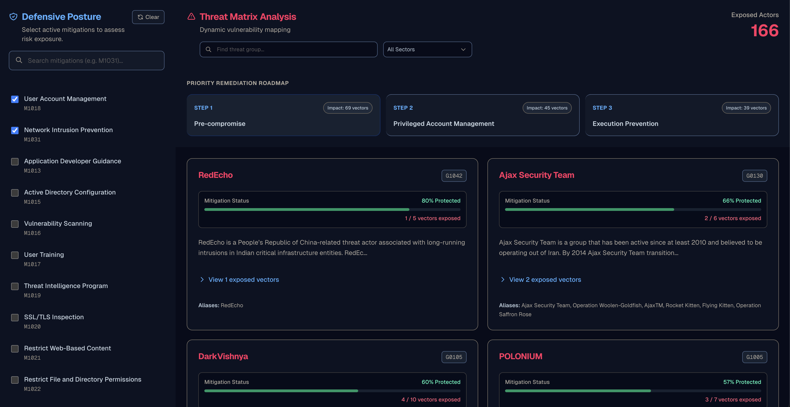

# MitigApp | Threat Matrix Analysis

**[🟢 View Live Application](https://mitigapp.vercel.app)**

MitigApp is a dynamic vulnerability mapping and priority remediation engine. By processing raw MITRE ATT&CK STIX data, it transforms complex threat intelligence into actionable defensive analysis. This allows security professionals to instantly visualize their risk exposure and identify the mitigations that provide the highest ROI for their network.

## Features

* **Dynamic Threat Matrix:** live calculation of exposed threat actors and vulnerable attack vectors based on active network defenses.
* **Priority Remediation Roadmap:** An algorithmic engine that cross-references over 15,000 threat behaviors to suggest the exact mitigations that will close the most attack vectors.
* **Sector-Based Heuristic Filtering:** Instantly filter threat actors by targeted industry (e.g., Financial, Healthcare, Defense) using intelligent keyword scanning on MITRE descriptions.
* **Automated STIX Ingestion:** Fully automated CI/CD pipeline via GitHub Actions that pulls, deduplicates, and batch upserts the latest MITRE CTI data daily.

## Tech Stack

* **Frontend:** Next.js (React), TypeScript, Tailwind CSS
* **Backend:** FastAPI (Python), Pydantic
* **Database:** Supabase (PostgreSQL)
* **Automation:** GitHub Actions, Python `requests`, `stix2` parser
* **Deployment:** Vercel (Frontend), Railway (Backend)

## Architecture Overview

### The Risk Engine (`main.py`)
The FastAPI backend bypasses standard API limitations by implementing efficient database pagination. It calculates the delta between a user's active mitigations and the known techniques utilized by specific threat groups. It dynamically ranks unapplied mitigations by calculating the exact number of exposed techniques they would intersect and neutralize.

### Daily Sync Pipeline (`ingest.py` & `.github/workflows`)
To maintain an accurate threat landscape without overloading the database, a scheduled GitHub Action runs a Python ingestion script nightly. The script:
1. Downloads the latest STIX JSON from the official MITRE repository.
2. Parses Mitigations, Techniques, and Intrusion Sets.
3. Performs in-memory deduplication of many-to-many relationships to prevent Unique Constraint violations.
4. Executes chunked `upsert` operations (batching 1,000 rows at a time) to Supabase, reducing execution time from potential timeouts to under 30 seconds.